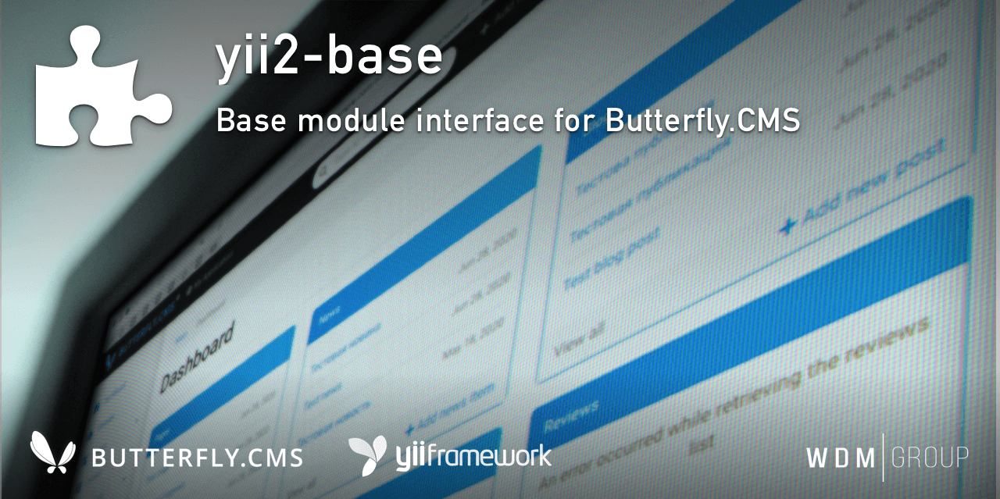

# Yii2 Base Module
Base module interface for [Butterfly.CMS](https://github.com/wdmg/butterfly.cms).

Copyrights (c) 2019-2021 [W.D.M.Group, Ukraine](https://wdmg.com.ua/)

# Requirements 
* PHP 5.6 or higher
* Yii2 v.2.0.40 and newest

# Installation
To install the module, run the following command in the console:

`$ composer require "wdmg/yii2-base"`

# Status and version [ready to use]
* v.1.3.2 - Fixed base models and registerTranslations()
* v.1.3.1 - Fixed UrlManager init, extended module dashboardNavItems() method
* v.1.3.0 - Aliases, added `runConsole()`, `getPrev()` and `getNext()` methods
* v.1.2.4 - Bugfix, added new method `isRestAPI()`
* v.1.2.3 - Fixed UrlManager (strict parsing off), bootstrap autoload
* v.1.2.2 - Methods compatibility for DynamicModel
* v.1.2.1 - Added SluggableBehavior(), implement for base ActiveRecord
* v.1.2.0 - Added base ActiveRecord and ActiveRecordML